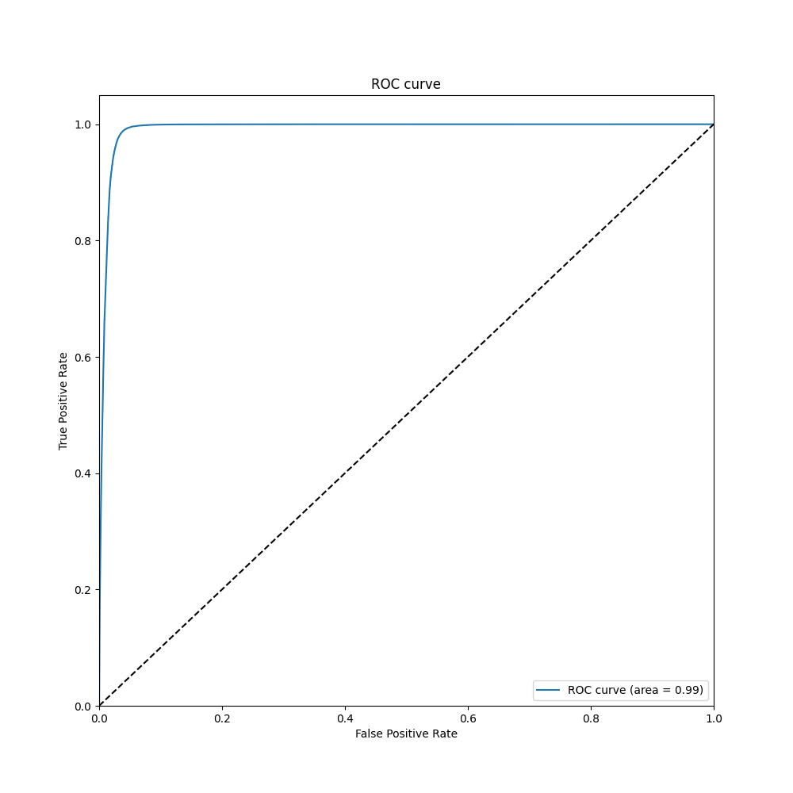

# MIA_ML

### Implementation of Shokri et al(2016) [Membership Inference Attacks Against Machine Learning Models](https://arxiv.org/pdf/1610.05820.pdf)

### How to run

1. (Optional) Customize train / inference configurations in config.yaml

2. (Optional) `python train_target.py`: Train the victim model which is the target of the extraction.

3. `python train_shadow.py`: Corresponds to Diagram 1-1 ~ Diagram 2-2 illustrated below.

4. `python train_attack.py`: Corresponds to Diagram 2-3 ~ Diagram 3 illustrated below.

5. `python inference_attack.py`: Corresponds to Diagram 4 illustrated below.

### Result

- Replicated the paper's configuration on [config.yaml](./config.yaml)
- Below is an example of ROC Curve plotting `TPR / FPR` according to MIA classification thresholds for CIFAR 100 dataset

| MIA Attack Metrics | Accuracy | Precision | Recall | F1 Score |
| :----------------: | :------: | :-------: | :----: | :------: |
|      CIFAR10       |  0.8376  |  0.8087   | 0.8834 |  0.8444  |
|      CIFAR100      |  0.9746  |  0.9627   | 0.9875 |  0.9749  |

### Paper's Methodology in Diagrams

